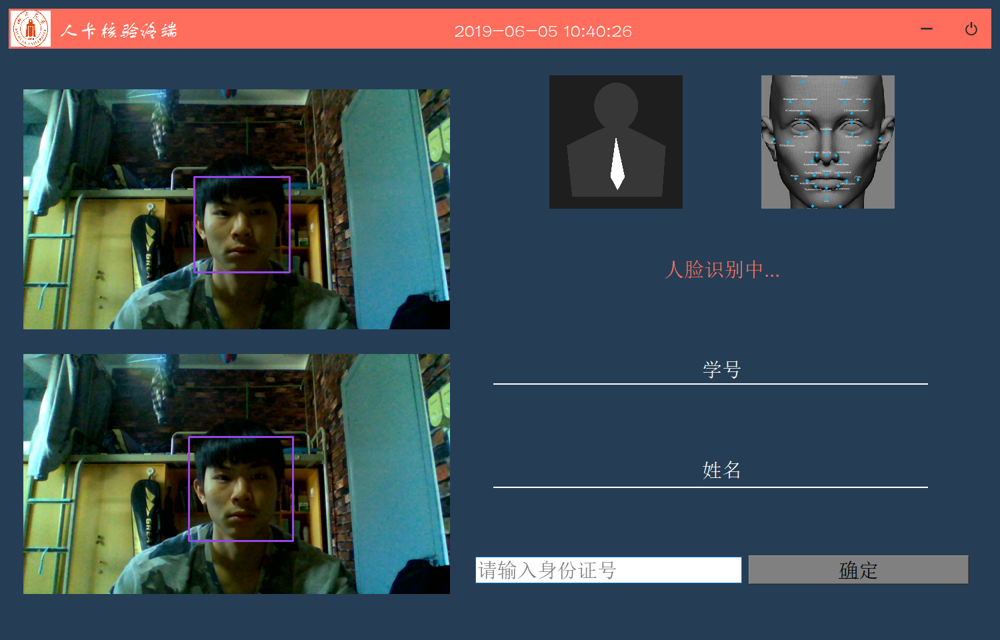

# facereg

#### 运行这些界面需要导入的包：

>import cv2
>
>from PyQt5 import QtCore, QtGui, QtWidgets
>
>from PyQt5.QtWidgets import *
>
>from PyQt5.QtCore import *
>
>from PyQt5.QtGui import *
>
>import os
>
>import time
>
>import sys
>
>from DATABASEOP import *

可通过 pip install 安装cv2 和 pyqt5,详情可百度

##### 其中DATABASEOP是我本地测试的数据库操作，本项目实际操作需要连接贾典的数据库操作模块，若果运行有问题，可以将相关数据库操作删除再运行。

### 运行视图展示

##### 登录到中心平台

##### 中心平台UI（有待更新）

##### 终端UI(只需要人脸识别包便可以进行识别了)

