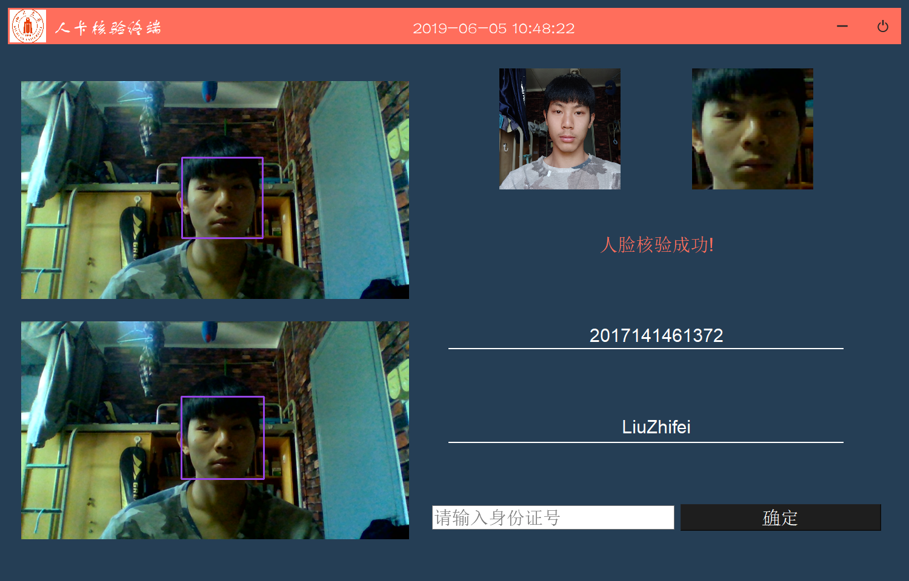

# facereg

#### 运行这些界面需要安装的包：

>import cv2
>
>import PyQt5

可通过 pip install 安装cv2 和 pyqt5,详情可百度

##### 运行终端时请更改   device.txt  文件中的值，代表终端号

##### 直接运行facereg_end.py即可

### 运行视图展示

##### 登录到中心平台

##### 中心平台UI（有待更新,wqy用Django重做）

##### 终端UI

##### 核验成功

##### 重复核验

##### 用户不存在

##### 核验失败

